# UNSPECIFIC: Analyzing Superficial Instruction Following of LLMs via General Constraint Synthesis

A modular framework for synthesizing instruction-following constraints from reference documents and measuring how superficially LLMs satisfy them, across multiple domains (blogs, stories, news).

UNSPECIFIC targets a known loophole in back-translation benchmarks: a constraint-synthesis model often copies very specific text from the reference, and the evaluated LLM trivially satisfies the constraint by copying that text back. To counter this, the pipeline:

- synthesizes constraints **common to two similar reference articles** to reduce copy-pasting,
- **selectively hardens** only the trivially satisfied constraints to balance difficulty and naturalness, and
- evaluates satisfaction on **both the generated article and its summary** to penalize superficial fulfillment.

**Documentation map:** [AGENTS.md](AGENTS.md) (guidelines for tools and contributors) · [scripts/README.md](scripts/README.md) · [configs/README.md](configs/README.md) · [data/README.md](data/README.md) · [cs4/README.md](cs4/README.md)

## Installation

### Prerequisites

- Python 3.10+
- API keys: at minimum `OPENAI_API_KEY` and `CLAUDE_API_KEY` (see [`cs4/config.py`](cs4/config.py) and [`Config.validate_api_keys`](cs4/config.py))
- Conda (recommended)

### Setup

```bash
git clone <repository-url>
cd cs4

# Create conda environment (requirements from env/environment.yaml + requirements.txt)
cd env
conda env create -f environment.yaml
conda activate cs4
cd ..

# Configure API keys — .env lives at the repository root
cp .env.example .env
# Edit .env: OPENAI_API_KEY=..., CLAUDE_API_KEY=...
```

## Running CLI scripts

From the repository root, ensure the package is importable:

```bash
export PYTHONPATH="${PWD}"
```

See [scripts/README.md](scripts/README.md) for the full script inventory and typical artifact flow.

## Pipeline overview

```mermaid
flowchart LR
  raw[raw_urls_archives]
  proc[processed_csvs]
  emb[embeddings_pairs]
  merged[merged_blogs_csv]
  constr[constraints_csv]
  revise[hardened_constraints_csv]
  base[base_generated_csv]
  fit[fitted_content_csv]
  summ[summary_csv]
  eval[evaluation_results_csv]

  raw --> proc
  proc --> emb
  emb --> merged
  merged --> constr
  constr --> revise
  revise --> base
  base --> fit
  fit --> summ
  fit --> eval
  summ --> eval
```



The core stages above map to scripts under `scripts/`. Optional/auxiliary stages include constraint hardening (`scripts/constraints/revise_constraints*.py`), summary generation (`scripts/data_prep/summarize_content.py`), one-shot direct generation (`scripts/generate_direct.py`), and copy-paste / naturalness / quality analyses (`scripts/analysis/`, `scripts/evaluation/`). See [scripts/README.md](scripts/README.md) for the full inventory.

## Quick start (blog domain)

Adjust paths to match your files. Models default from [`cs4/config.py`](cs4/config.py) unless you pass `--model`.

### Data preparation

```bash
export PYTHONPATH="${PWD}"

# Merge blog pairs into single posts (input: pairs CSV from embedding pipeline)
python scripts/data_prep/merge_blogs.py \
  --input-path data/processed/blog_pairs.csv \
  --output-path data/processed/merged_blogs.csv
```

### Stage 1: Constraint generation

Extracts atomic constraints from sample content (default content column: `Merged Blog`).

```bash
python scripts/constraints/generate_constraints.py \
  --domain blog \
  --input-path data/processed/merged_blogs.csv \
  --output-path data/outputs/constraints.csv \
  --model gpt-4.1-mini
```

### Stage 2: Base generation

Generates content from the task description without applying constraints yet.

```bash
python scripts/base/generate_base.py \
  --domain blog \
  --input-path data/outputs/constraints.csv \
  --output-path data/outputs/base_generated.csv \
  --model gpt-4.1-mini
```

### Stage 3: Constraint fitting

Revises base content to satisfy the constraint list (legacy mode: separate constraints and base CSVs).

```bash
python scripts/constraints/fit_constraints.py \
  --domain blog \
  --constraints-path data/outputs/constraints.csv \
  --base-path data/outputs/base_generated.csv \
  --output-path data/outputs/fitted_content.csv \
  --constraint-column constraints \
  --model gpt-4.1-mini
```

(`--constraint-column` defaults to `selected_constraints` in the CLI; generated `constraints.csv` uses the column name `constraints`, so passing it explicitly avoids ambiguity.)

### Stage 4: Evaluation

```bash
python scripts/evaluation/evaluate.py \
  --domain blog \
  --input-path data/outputs/fitted_content.csv \
  --output-path data/outputs/evaluation_results.csv \
  --provider anthropic
```

Default evaluation **model** is defined in `cs4/config.py` (`DEFAULT_EVALUATION_MODEL`). If that default is a Claude model ID, use `--provider anthropic` (as above). For OpenAI-only evaluation, pass `--provider openai` and an OpenAI-compatible `--model`. `evaluate.py` accepts only `openai` or `anthropic` providers and supports `--parallel` / `--max-workers` and an Anthropic-only `--batch` mode.

## Optional / advanced stages

These stages implement the parts of UNSPECIFIC that go beyond plain back-translation.

### Constraint hardening

After an initial evaluation reveals which constraints are trivially satisfied (e.g. by copy-pasting), selectively rewrite the easy ones into harder, less copyable versions.

```bash
# Eval-informed hardening (uses an evaluation_results.csv to target easy constraints)
python scripts/constraints/revise_constraints_with_eval.py \
  --constraints-path data/outputs/constraints.csv \
  --base-path data/outputs/base_generated.csv \
  --eval-path data/outputs/evaluation_results.csv \
  --output-path data/outputs/hardened_constraints.csv \
  --provider anthropic --parallel
```

`scripts/constraints/revise_constraints.py` performs the same hardening without an eval file. `scripts/constraints/filter_easy_constraints.py` drops rows by satisfaction-rate threshold, and `scripts/constraints/generate_common_constraints.py` synthesizes constraints common to two similar articles.

### Summary-based evaluation

To penalize superficial fulfillment, generate a summary of the fitted content and evaluate constraint satisfaction against the summary as well as the full article.

```bash
# Summarize fitted content (default target length: 25% of original)
python scripts/data_prep/summarize_content.py \
  --input-path data/outputs/fitted_content.csv \
  --output-path data/outputs/summaries.csv \
  --content-column fitted_content \
  --provider anthropic

# Evaluate satisfaction against the summary column
python scripts/evaluation/evaluate.py \
  --domain blog \
  --input-path data/outputs/summaries.csv \
  --output-path data/outputs/evaluation_on_summary.csv \
  --content-column summary \
  --provider anthropic
```

### One-shot direct generation (baseline)

`scripts/generate_direct.py` generates content directly from the task and constraints in a single step (no separate base + fit), useful as a baseline. It supports `--provider openai|anthropic|together` and `--parallel`.

### Analysis

`scripts/analysis/score_copy_paste.py` scores copy-paste behavior, `scripts/evaluation/evaluate_quality.py` and `scripts/evaluation/evaluate_naturalness.py` run pairwise comparisons, and `scripts/embeddings/compare_text_similarity.py` computes row-aligned cosine similarity between two CSV columns.

## Default models and parameters

Authoritative values are in [`cs4/config.py`](cs4/config.py). At the time of writing:

| Setting                                      | Typical role                               |
| -------------------------------------------- | ------------------------------------------ |
| `DEFAULT_MERGE_MODEL`                        | Blog merging                               |
| `DEFAULT_CONSTRAINT_MODEL`                   | Constraint generation                      |
| `DEFAULT_BASE_GEN_MODEL`                     | Base content generation                    |
| `DEFAULT_FITTING_MODEL`                      | Constraint fitting                         |
| `DEFAULT_EVALUATION_MODEL`                   | Satisfaction evaluation                    |
| `DEFAULT_MODEL`                              | Fallback when a stage does not set a model |
| `NUM_CONSTRAINTS`                            | Target count (39)                          |
| `SIMILAR_THRESHOLD` / `DISSIMILAR_THRESHOLD` | Embedding / pair logic                     |
| `MAX_RETRIES` / `RETRY_DELAY`                | LLM call retries                           |

## Configuration

### Environment variables

Set in `.env` at the **repository root** (see [.env.example](.env.example)):

- `OPENAI_API_KEY`
- `CLAUDE_API_KEY`
- Optional: `TOGETHERAI_API_KEY` (some clients)

### YAML configs

Logging and data-ingest jobs use files under `configs/`; see [configs/README.md](configs/README.md). There is **no** `configs/domains/` tree in this repository despite `Config.load_domain_config` in code—do not assume per-domain YAML files exist.

## Monitoring

```bash
tail -f logs/constraint_generation.log
```

```bash
python -c "from cs4.utils.llm_client import get_total_usage; print(get_total_usage())"
```

## Analyzing results

```python
import pandas as pd

df = pd.read_csv("data/outputs/evaluation_results.csv")
print(f"Total samples: {len(df)}")
print(f"Average satisfaction: {df['satisfaction_rate'].mean():.2%}")
print(df["satisfaction_rate"].describe())
```

## Project structure

```
cs4/
├── AGENTS.md              # Agent / contributor guidelines
├── .env.example           # Copy to .env at repo root
├── cs4/                   # Python package ([cs4/README.md](cs4/README.md))
│   ├── core/              # Pipeline implementations
│   ├── utils/             # LLM clients, logging, IO, embeddings
│   └── schemas.py         # CSV validation helpers
├── scripts/               # CLI ([scripts/README.md](scripts/README.md))
├── configs/               # YAML ([configs/README.md](configs/README.md))
├── notebooks/             # Exploratory / ad hoc workflows
├── env/                   # Conda environment definition
└── data/                  # Data layout ([data/README.md](data/README.md))
```

## License

This project is licensed under the MIT License.
